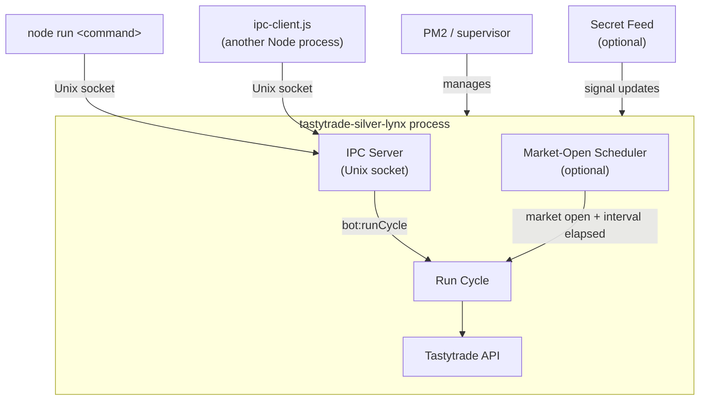

# Tastytrade Silver Lynx

A production options execution engine for Tastytrade — automated, risk-gated, and fully inspectable.

The scheduler runs a full allocation and risk-management cycle at a configurable interval during market hours. Each cycle enforces entry criteria, sizes positions against real capital, applies strategy-level risk rules, and records structured reasoning for every decision. All workflows are also available on demand over a local Unix IPC socket — candidate discovery, health checks, order placement, and cycle control — with or without the scheduler running.

## System Profile

Silver Lynx is built as an execution control plane, not just a script runner.

- Deterministic run cycle: each cycle builds a full context snapshot, evaluates group-level strategy decisions, then executes allocation, close, and seed actions with explicit reasoning recorded for every step.
- Execution quality controls: IV rank filtering and bid/ask spread checks gate every entry. Orders are routed across bid/mid/ask using configurable weights, where each route concedes a different amount of the spread: bid rests at the bid, mid concedes at most a few ticks, and ask starts at the midpoint and chases to the ask on a fast clock — no route pays the full spread instantly.
- Risk-first circuit breakers: strategy logic enforces profit capture targets, drawdown floors, cooldown periods, no-buy cutoffs, and end-of-day position constraints before any order is placed.
- Multi-account aware: the cycle can run account-specific or fan out across all managed accounts, with cash and margin policies — including position sizing and exposure caps — applied independently per account type.
- Session-gated automation: the scheduler checks live Tastytrade session status and only runs during regular equities options windows. Extended-hours sessions are never treated as open.
- Optional signal ingestion: an external feed can influence buy-weighting and trigger auto-seed actions, but the engine is fully operational without it.
- Audit trail by default: each run appends structured NDJSON history (plan, decisions, execution summary, snapshot metrics) for after-action review and debugging.

## Operating Model

At a high level, each cycle follows this sequence:

1. Pull balances, positions, market session state, and optional secret-signal context.
2. Build execution targets (time-of-day DTE, exposure target, bid/mid/ask route weights).
3. Evaluate every position group against strategy rules (profit capture, drawdown floors, cooldowns, no-buy cutoffs, EOD behavior).
4. Generate an execution plan and route order sizing by available capital and route weights.
5. Execute and record outcomes, including placement/skips, close actions, overnight reductions, and cross-account seed decisions.

## Runtime Topology



## Code Architecture

The source tree is split into three layers, each with a matching env var prefix:

| Layer | Directory | Env prefix | Responsibility |
|---|---|---|---|
| Core | `src/core/` | `CORE_` | Tastytrade API client, market data, balances, sessions, option chain snapshots |
| Bot | `src/bot/` | `BOT_` | Run cycle orchestration, scheduling, order execution, data persistence |
| Strategy | `src/strategy/` | `STRATEGY_` | Trading decisions — DTE/exposure targets, entry filters, risk limits, seed logic, option candidate selection |

The optional external signal feed lives under `src/strategy/secret/` and uses `SECRET_` env vars.

Dependencies flow one way: `strategy` → `core`, `bot` → `core`, `bot` → `strategy`. The IPC server commands follow the same namespacing: `core:` for infrastructure queries, `bot:` for execution and cycle control, `strategy:` for decision-layer introspection.

## Setup

### 1. Clone and Install

```bash
git clone <repo-url> ~/code/tastytrade-silver-lynx
cd ~/code/tastytrade-silver-lynx
npm install
```

### 2. Configure Environment

```bash
cp .env.example .env
# open .env and fill in required values (see credentials section below)
```

### 3. Obtain API Credentials

`CORE_API_CLIENT_SECRET` and `CORE_API_REFRESH_TOKEN` come from Tastytrade's OAuth2 flow. Follow the [Tastytrade OAuth2 guide](https://developer.tastytrade.com/oauth/) to register an application and obtain these values. The SDK automatically refreshes the access token at runtime — you only need to supply the long-lived refresh token.

## Environment Variables

Env vars are organized by the layer that owns them: `CORE_` for infrastructure, `BOT_` for orchestration, `STRATEGY_` for trading logic, and `SECRET_` for the optional external signal feed.

### Core (required)

- `CORE_BASE_URL` — Tastytrade API base URL. Defaults to `https://api.tastyworks.com`.
- `CORE_API_CLIENT_SECRET` — OAuth2 client secret from Tastytrade.
- `CORE_API_REFRESH_TOKEN` — Long-lived refresh token from Tastytrade's OAuth2 flow.

### Core (optional overrides)

- `CORE_IPC_SOCKET` — Override the Unix socket path for the IPC server.
- `CORE_OPTION_MARKET_SNAPSHOT_TTL_MS` — Cache TTL for option chain snapshot lookups. Defaults to `30000`; set to `0` to disable.
- `CORE_CASH_ACCOUNT_MAX_BUYING_POWER_PCT` — Maximum fraction of cash buying power the bot can deploy in a day. Defaults to `0.6`, capped at `0.9`.
- `CORE_QUOTE_STREAMER_MAX_RECONNECT_ATTEMPTS` — Number of in-process dxLink reconnect attempts (close old session, re-auth, resubscribe, with backoff) the quote-streamer watchdog tries before falling back to exiting for a PM2 restart. Defaults to `3`, clamped to at most `10`; set to `0` to skip in-process reconnects and exit immediately (previous behavior).

### Bot

- `BOT_RUN_ON_SCHEDULE` — Set to `true` to start the market-open scheduler when the process boots. Defaults to `false`.
- `BOT_RUN_INTERVAL_MS` — Scheduler interval in milliseconds while the market is open.
- `BOT_RUN_INTERVAL_MINUTES` — Scheduler interval in minutes. Used when `BOT_RUN_INTERVAL_MS` is not set.
- `BOT_DATA_DIR` — Override the root data directory. Defaults to `data/`; run history and the position registry live in `runs/` and day reports in `day-reports/` beneath it.
- `BOT_DO_NOT_TOUCH_GROUPS` — Comma-separated group keys the bot should leave alone.
- `BOT_READ_ONLY_ACCOUNTS` — Comma-separated account numbers the bot can inspect but should not trade.
- `BOT_CLOSE_ONLY_OPENABLE_INSTRUMENTS` — Kill switch for the close-instrument guard: **the bot may only close what it is capable of opening.** Defaults to `true`. Every buy path hard-codes `Equity Option` (`manage-allocation.ts`, `spray-buy.ts`, `seed-symbol.ts`), but `buildClosingOrderPayload` reads the instrument type off the *position*, so the bot could only ever open an option yet would faithfully sell whatever it found held — and the margin EOD sweep repeatedly liquidated hand-bought SHARES. Equity is not an edge case in the data model: a share lot has no C/P suffix, so `evaluate-position.ts` keys it as `TICKER::none` and every strategy branch treats it like an option group. The guard sits at order DISPATCH (`execute-position-evaluations.ts`, `overnight-position-reduction.ts`, `close-symbol-position.ts`), deliberately **not** as an implicit `BOT_DO_NOT_TOUCH_GROUPS` entry: do-not-touch groups are dropped from the execution-path exposure sums, so marking equity hands-off would make the bot size its option buys as though that capital were free. Guarding at dispatch keeps equity in the exposure denominator, which is correct — the capital is committed. Every withheld order logs one JSON line with `"token":"CLOSE_INSTRUMENT_SUPPRESSED"` carrying the ticker, group key, instrument type, dispatch site, requesting branch and quantity. Set to `false` to restore the previous behaviour. Note the guard is a blanket instrument rule, not a provenance rule; when the planned SMS path lets the owner direct the bot to buy shares, it must become provenance-aware (see `src/bot/position-provenance.ts`) rather than simply widening the openable set.
- `BOT_BUY_ONLY_OPENABLE_INSTRUMENTS` — The ENTRY twin of the guard above, sharing its `isOpenableInstrument` predicate (`src/bot/close-instrument-guard.ts`). Only lets the allocator accumulate into groups holding an instrument the bot can itself open (`Equity Option`). Defaults to `true`. Hand-bought **shares** have no C/P suffix, so they group as `TICKER::none`, and `getCandidateSide` defaults a sideless group to `"call"` — which made an equity holding an accumulation target for option buys on the same underlying. Suppressions are logged on the `ALLOCATION_INSTRUMENT_SUPPRESSED` token and surface as ordinary `placedOrder: false` skips in run history, so the equity stays in the exposure denominator (unlike `BOT_DO_NOT_TOUCH_GROUPS`, which removes a group from the sizing sums entirely). Set to `false` to restore the previous behavior. **This changes sizing behavior**, not just exits.

### Strategy: Seed Thresholds

- `STRATEGY_MARGIN_SEED_FROM_CASH_MIN_DOWN_PCT` — Minimum cash-position ask-return loss percentage before the bot considers seeding the margin account. Leave unset to disable.
- `STRATEGY_MARGIN_SEED_FROM_CASH_MAX_DOWN_PCT` — Maximum loss percentage allowed for margin seeding. Prevents seeding when the cash position is already too close to the bid stop-loss floor. Defaults to `14`.
- `STRATEGY_CASH_SEED_FROM_MARGIN_MIN_DOWN_PCT` — Minimum margin-position loss percentage before considering seeding the cash account. Leave unset to disable.
- `STRATEGY_CASH_SEED_FROM_MARGIN_MAX_DOWN_PCT` — Maximum loss percentage for cash-from-margin seeding. Defaults to `20`.
- `STRATEGY_MAX_ASK_RETURN_PERC_FOR_BUY` — Maximum ask-return threshold for buy orders. Unset by default; `.env.example` uses `0.2`.
- `STRATEGY_MARGIN_SEED_REQUIRE_FULL_THESIS` — Restore the retired full-thesis requirement on **feed-driven margin auto-seeds** (`src/strategy/secret/secret-auto-seed.ts`). Defaults to `false`: a margin auto-seed needs the feed's live `willBuy` and nothing else from the thesis rollup. Until 2026-08-08 it additionally required the feed's full thesis (`thesisCount ≥ thesisMax`) to have been observed at some point that day. That requirement was removed because it measured **backwards** over 8 instrumented sessions (07-22, 07-23, 07-24, 07-27, 08-04 → 08-07), read straight off the `secret-auto-seed-margin-sticky-block` log line: names the gate blocked beat names it passed by **2.35 percentage points** of universe-excess return on the underlying to the margin EOD line, 90% day-clustered CI `[-3.75, -1.00]`, sign stable under drop-one-name and drop-one-day. The time-of-day confound runs *against* the finding — blocked events landed later in the session (median 10:59 PT vs 08:40 PT), so they earned their excess in a shorter window, and the time-matched +60m horizon agrees in sign. 13 of 41 distinct (day, symbol) `willBuy` candidates were blocked for the whole day. Structurally the gate largely graded its own entry conditions: 3 of the 4 flags behind `thesisCount` are upstream buy preconditions or the `buyWeight` threshold. **Caveat:** that is the *underlying's* move, not option P&L — at 15–30% option spreads a 2% underlying move is not automatically a win, so this is decisive against the gate's stated purpose (name selection) rather than proof the newly-admitted seeds print. Set to `true` to re-arm the old gate without a deploy. The knife brakes (`SECRET_SEED_MIN_PLATEAU`, the add-governor) are unaffected either way.

### Strategy: Position Gate Signal Settings

- `STRATEGY_CROSS_ACCOUNT_YES_DOWN_PCT` — How far down the cash position must be before it generates a cross-account yes signal. Defaults to `10`.
- `STRATEGY_GATE_BASIC_PERCENT_OF_BALANCE_THRESHOLD` — `percentOfBalance` base for basic stock yes qualification. Time-scaled: half the base at window start, rising to the base by 1pm. Keep below the strong threshold so the basic bar stays easier. Defaults to `25`.
- `STRATEGY_GATE_STRONG_PERCENT_OF_BALANCE_THRESHOLD` — `percentOfBalance` base for strong stock yes qualification (with `isQualityToBuy`). Time-scaled the same way. Defaults to `30`. Legacy alias: `STRATEGY_GATE_STRONG_STOCK_YES_MAX_PCT`.
- `STRATEGY_GATE_BASIC_DAYTRADE_SCORE_THRESHOLD` — Daytrade score base for basic stock yes qualification (in addition to `isQualityToBuy`). Time-scaled: half the base at window start, tightening to the base by 1pm (scores build magnitude through the session). Defaults to `-40`.
- `STRATEGY_GATE_STRONG_DAYTRADE_SCORE_THRESHOLD` — Daytrade score base for strong stock yes qualification (with `isQualityToBuy`). Time-scaled the same way. Defaults to `-100`. Legacy alias: `STRATEGY_GATE_STRONG_DAYTRADE_SCORE_MAX` (positive magnitude).
- `STRATEGY_GATE_SINGLE_YES_MAX_TARGET_PCT` — Maximum target exposure with one yes signal. Defaults to `0.15`.
- `STRATEGY_GATE_BASIC_YES_MAX_TARGET_PCT` — Maximum target exposure with only a basic stock yes signal. Defaults to `0.10`.
- `STRATEGY_GATE_BOTH_YES_MAX_TARGET_PCT` — Maximum target exposure when both yes signals are true. Defaults to `0.25`.
- `STRATEGY_GATE_STRONG_YES_MAX_TARGET_PCT` — Maximum target exposure with a strong stock yes signal. Defaults to `0.35`.
- `STRATEGY_MARGIN_MAX_TARGET_MULTIPLIER` — Multiplier applied to the gate ceiling for margin accounts. Defaults to `1.33`.
- `STRATEGY_MARGIN_CROSS_ACCOUNT_THRESHOLD_MULTIPLIER` — Makes the cross-account threshold stricter for margin accounts. Defaults to `2`.
- `STRATEGY_GATE_BOOLEAN_BOOST_PCT` — Additional max target percentage per favorable boolean signal. Defaults to `0.03`.

### Strategy: Stop Loss Floors

- `STRATEGY_INTRADAY_STOP_LOSS_PCT` — Intraday bid-return loss floor before the bot cuts off accumulation. Defaults to `30`.
- `STRATEGY_EOD_STOP_LOSS_PCT` — End-of-day bid-return loss floor after the accumulation cutoff. Defaults to `10`.
- `STRATEGY_STOP_LOSS_REQUIRE_MID_CONFIRM` — Require the **midpoint** to also be under water before the *intraday* bid stop fires. Defaults to `true` since 2026-08-08 (it shipped `false`); set it to `false` to restore the original bid-only stop. Measured over the run ledger 2026-07-06 → 2026-08-07 (n=80 closes, 34 of them stops), the realized fill landed a median 8.2pp of entry *above* the bid the stop triggered on and 2.7pp *below* the midpoint — the bid is a biased estimator of what a position is worth, and the bias is roughly twice as large on cash (mid-minus-bid gap 16.7pp) as on margin (7.6pp). Over 2026-07-17 → 08-07, **15 of 34 stops fired while the position was flat or up on the offer**, the bot's own fills came in +14.5pp better than the trigger bid in 20 of 25 cases, and 15 of 17 intraday stops had a midpoint above −30%. Only the intraday floor consults this; the EOD floor never does.
- `STRATEGY_STOP_LOSS_MID_CONFIRM_PCT` — How far under water the midpoint must be for that confirmation, as an integer percent. Defaults to `20`. Clamped to `STRATEGY_INTRADAY_STOP_LOSS_PCT`, so it can never be deeper than the bid floor it qualifies. At the default it defers exactly the 6 demonstrably-wrong stops in the window (CNH, TDOC, IOVA, SG, AUR, PTON) and still fires the 11 real ones, whose median realized was −29.6%. **Do not raise it to 25** — that defers 11 of the 17 intraday stops, including genuinely dead positions sitting at a −22% midpoint.
- `STRATEGY_STOP_LOSS_PERSIST_CYCLES` — Consecutive *cycles* of the same position group that must see the *intraday* stop trigger before it closes. Cycles, not evaluations: one cycle re-evaluates every group 5-6 times, and all of those count as the one cycle. Defaults to `2`; `1` restores the pre-2026-08-08 fire-on-the-first-print behavior. The streak is keyed per account + `UNDERLYING::side` and stamped with the cost basis, so it never leaks across accounts and a re-entered position never inherits a stale streak. Rationale: **5 of the 5 stops with full-day quote history fired on one cycle out of the 26–100 cycles that position was held**, on days whose median bid return was only −10% to −23%, and 15 of 21 stops fired in the first or last 30 minutes where the median spread was 57% versus 24.5% midday. While a streak is building the group holds and suppresses adds. This does *not* gate the EOD stop or the margin EOD liquidation.
- `STRATEGY_STOP_LOSS_PERSIST_BYPASS_PCT` — Collapse escape hatch for the above: when the bid **and** the midpoint are both at or below −this, the stop fires immediately with no streak requirement. Defaults to `45` (1.5× the intraday floor) and is clamped to at least 1.25× `STRATEGY_INTRADAY_STOP_LOSS_PCT` so it can never be set shallow enough to swallow the ordinary stop. Requiring the midpoint to agree is what makes it safe: a phantom bid alone must never buy an instant exit. On the measured window this bypass fires on zero stops — it is tail insurance, not a tuned knob.

### Strategy: Take Profit

- `STRATEGY_TAKE_PROFIT_ALLOW_MID` — Let the dynamic take-profit target fire on the **midpoint** as well as the bid. Defaults to `true`; set it to `false` for the original bid-only target. The take-profit reads the same bid the stop does, so the same wide spreads that make the stop fire early make the target fire late or never: over 2026-07-17 → 08-07, across 14 symbol-days, **158 cycles sat above the dynamic target at the midpoint while the bid had not reached it, against 5 cycles where the bid triggered** — SGML finished 2026-08-07 at a +22.3% midpoint and never sold. Executability is guarded two ways. The non-urgent close chase starts at the ask and walks *down* to the bid, so the mid path additionally requires the **bid to be at or above breakeven** (an invariant, not a knob: a close classified `take-profit` must never book a loss). And a mid-triggered close does not get the bid-target waiver on the close-side spread ceiling, so on a genuinely unusable spread it is skipped and the position simply held for another cycle rather than dumped.
- `STRATEGY_TAKE_PROFIT_MID_MARGIN_PCT` — How far *above* the dynamic target the midpoint must sit for that path, as an integer percent. Defaults to `5` (target + 5pp). The margin exists because the chase concedes downward from the ask: a midpoint exactly at target would land under it on any fill below mid.

### Strategy: Close Execution

- `STRATEGY_CLOSE_REQUOTE_BEFORE_FINAL_TICK` — Pull a live quote immediately before the close tick-chase posts its **last** rung, and price that rung off the fresh quote instead of the cycle-start snapshot. Defaults to `false`, which walks exactly today's ladder and never makes the extra quote call. Rationale: every price in the chase descends from a cycle-start bid/ask, and the ladder then dwells 10s (urgent) to 30s (normal) per rung, so the rung that is meant to guarantee the clear is routinely priced off a quote minutes old. Over the run ledger 2026-07-06 → 2026-08-07, 7 of 80 closes filled *below* the bid quoted at the deciding cycle (126.6pp of entry, at a median spread of only 14.2%) and 4 filled above the quoted ask. The refreshed edge is monotone — a sell edge may only move **down**, a buy edge only up — so it can chase a market that ran away but can never retract a concession the chase already made. Any unusable answer (no quote, no bid, a lookup that throws) leaves the stale ladder in place.

### Strategy: Position Sizing and Exposure

- `STRATEGY_MARGIN_MAX_TOTAL_UTILIZATION` — **Leverage rail (enforced by default).** Caps the summed market value of all open margin option positions at this multiple of margin NLV. This is a leverage *multiple* (not a percent-of-account) and is read raw: it defaults to `1.5` and non-positive/non-finite values are refused and fall back to the default, so the rail is never accidentally off. Applies to the margin account only (the cash account is unlevered). Enforced in `src/strategy/seed-sizing-live.ts`.
- `STRATEGY_MAX_OPTION_SPREAD_PCT` — Maximum bid/ask spread as a fraction of the midpoint. Defaults to `0.3`.
- `STRATEGY_MARGIN_MAX_ENTRY_SPREAD_PCT` — Margin-only entry (buy-side) spread ceiling as a fraction of the midpoint. Defaults to the `STRATEGY_MAX_OPTION_SPREAD_PCT` value, so behavior is unchanged until set. Set it tighter than the shared gate (e.g. `0.10`) because margin must flatten by EOD and pays the spread on both entry and the forced exit; cash keeps using the shared gate.
- `STRATEGY_MIN_OPEN_INTEREST` — Minimum open interest on the requested side for a new-entry candidate. Defaults to `0` (disabled). Unknown/missing open interest always passes with a `liquidity-gate` log note — missing data is never treated as zero liquidity.
- `STRATEGY_PHANTOM_QUOTE_GUARD_ENABLED` — Set to `true` to distrust a candidate's spread-gate pass for the cycle when its quote shows an explicit zero bid or ask size during market hours (the quoted price has no depth behind it). Defaults to `false`; phantom detection is still logged on every `liquidity-gate` line, and missing/unknown sizes never trigger the guard.
- `STRATEGY_MARGIN_MAX_BUY_EXPOSURE_PCT` — Maximum fraction of total capital used for one margin allocation action. Defaults to `0.12`.
- `STRATEGY_CASH_MAX_BUY_EXPOSURE_PCT` — Maximum fraction of total capital used for one cash allocation action. Defaults to `0.05`.
- `STRATEGY_MARGIN_DIP_TARGET_BOOST_MAX_PCT` — Maximum boost to a margin group's target exposure as its **mid** loss deepens from `2%` to `12%`, applied only while boolean signals stay good (`>= 4`). Measured on the midpoint return (fair value), not the ask, so the boost can see bid-side spread pain. Unset disables the boost.
- `STRATEGY_MARGIN_DIP_TARGET_BOOST_MAX_SPREAD_PCT` — Wide-spread suppression for the dip boost: when the position's current bid/ask spread (fraction of mid) exceeds this value, the dip boost is suppressed (avoids averaging into a name whose "dip" is really a blown-out spread you can't exit). Unset/blank disables suppression (non-binding). Example: `0.15` suppresses when the spread is wider than `15%` of mid.
- `STRATEGY_MAX_ALLOCATION_BUY_POSITION_MULTIPLE` — Cap on a single allocation buy as a multiple of the group's current market value (e.g. `3` lets a `$87` position add at most `~$261` in one action), applied on top of the pct-of-capital caps. Unset disables the cap. Note this caps each *add*, not the total — because it re-reads current value every cycle, a fast series of adds compounds; use the two caps below to bound the total.
- `STRATEGY_MAX_UNDERLYING_CONTRACTS` — Absolute ceiling on total option contracts held per position group (`UNDERLYING::side`). Allocation buys are clamped to the remaining headroom and skipped once holdings reach the cap (logged under `allocation-underlying-cap`). Recomputed from live broker positions every cycle, so intraday restarts cannot re-open accumulation. `0` or unset disables the cap.
- `STRATEGY_OVERNIGHT_REDUCTION_DAYS_TO_SELLOFF` — Calendar days until a cash overnight position should be fully sold off. Defaults to `6`.
- `STRATEGY_OVERNIGHT_REDUCTION_START_FLOOR_PCT` — Exposure floor percentage on day 1 of overnight reduction; interpolates linearly to `0` by the selloff day. Defaults to `20`.
- `STRATEGY_MIN_IV_RANK_PCT` — Minimum IV rank (`0`–`100`) required before entering a position. Defaults to `20`; set to `0` to disable.
- `STRATEGY_MARGIN_TARGET_CALL_DELTA` — Target absolute delta for OTM call strike selection on margin accounts. Defaults to `0.35`.
- `STRATEGY_MARGIN_MAX_TARGET_DTE` — Hard ceiling on target DTE for margin accounts. Defaults to `7`.
- `STRATEGY_CASH_MIN_TARGET_DTE` — Hard floor on target DTE for cash accounts. Defaults to `7`.

### Secret Feed (Optional)

If these are omitted or the feed is disconnected, the runtime continues normally and all IPC workflows remain available.

- `SECRET_SOCKET_URL` — Private feed socket URL.
- `SECRET_SOCKET_AUTH_KEY` — Auth secret emitted via `attemptAuth` on every connect/reconnect. Required for outbound notifications (`client:act` log emits) — the server ignores them from unauthenticated sockets. Unset skips the auth attempt; inbound data updates still flow.
- `SECRET_SOCKET_TIMEOUT_MS` — Timeout for feed requests in milliseconds. Defaults to `5000`.
- `SECRET_DATA_UPDATE_POSITIONS_KEY` — Positions key inside the secret feed payload.
- `SECRET_AUTO_SEED_ON_POSITIONS_UPDATE` — Set to `true` to allow auto-seeding when position updates arrive. Defaults to `false`.
- `SECRET_AUTO_SEED_ON_TICKER_RECS_UPDATE` — Set to `true` to allow auto-seeding when ticker recommendations update. Defaults to `false`.
- `SECRET_AUTO_SEED_START_TIME` — Start of the auto-seed window in `HH:mm` format. Defaults to `06:30`.
- `SECRET_AUTO_SEED_COOLDOWN_MS` — Minimum delay between secret-feed auto-seeds for the same symbol. Defaults to `600000`.

### Retired Variables

These variables are no longer read as live caps. They are documented here so nobody re-adds them as phantom safety limits — sizing and concentration are now governed entirely by percent-of-NLV controls. The boot log (`src/startup-config.ts`) warns when an obsolete name is present.

- `BOT_MAX_SEED_ORDER_COST` — Retired 2026-07-21. Was a per-seed dollar cap (formerly defaulted to `200`). Seed sizing is now 100% percent-of-NLV via `SECRET_SEED_SIZING_FLOOR_PCT` / `SECRET_SEED_SIZING_CEILING_PCT`; there is no dollar clip.
- `STRATEGY_MAX_UNDERLYING_NOTIONAL` — Retired 2026-07-21. Was a per-group dollar ceiling on market value. `getMaxUnderlyingNotional()` in `src/strategy/risk-limits.ts` now returns `Infinity` (permanently off); the env var is ignored and flagged obsolete at boot. Per-group concentration is now bounded by `STRATEGY_MAX_UNDERLYING_CONTRACTS` and the percent-of-account caps.

## Running Tests

```bash
npm test
```

Runs the built-in Node test runner against `src/**/*.test.ts` via `tsx`. Note that `npm run typecheck` and the test suite verify code correctness — they don't exercise live API calls or the scheduler loop.

## Typecheck And Build

This project usually runs directly from TypeScript via `tsx`.

```bash
npm run typecheck
npm run build
```

- `typecheck` validates types only.
- `build` creates a bundled entrypoint at `build/index.js`.

## Run With IPC

`node run` is a thin CLI wrapper over `ipc-client.js`. It opens a JSON request over the local Unix socket to the running server and prints the result. The server must be running first.

Start the server in one terminal:

```bash
npm run start:tsx
```

Or run the build:

```bash
npm run start:build
```

The server listens on a local Unix socket (default: `.tastytrade-silver-lynx.sock`).

In another terminal, send commands through IPC.

### Core / Market Data Examples

```bash
node run core:getBidAskForSymbol AAPL
node run core:getUnderlyingPrice AAPL
node run core:fetchOptionChainWithVolume RUM
node run core:getBalanceSummary
node run core:getCurrentEquitiesSession
node run core:isEquityOptionsMarketOpen
node run core:cancelAllLiveOrders                  # emergency: cancel all working orders
node run core:cancelAllLiveOrders <ACCOUNT>        # cancel for one account only
```

### Candidate / Health Examples

```bash
node run bot:getOptionCandidates RUM call
node run strategy:getTopOptionCandidateForSymbol RUM call <MARGIN_ACCOUNT>
node run strategy:getTopOptionCandidateForSymbol RUM call <CASH_ACCOUNT>
node run strategy:getOptionHealthForSymbol RUM call
node run strategy:getOptionHealthForSymbol RUM call 14
```

`strategy:getOptionHealthForSymbol` returns target checks for `7`, `14`, and `30` DTE and includes summary fields like `healthyTargets`, `missingTargets`, and `fallbackTargets`.

### Allocation / Run Cycle Examples

```bash
node run bot:getCurrentAllocationBudget
node run strategy:getTimeOfDayExecutionTargets 10:14
node run bot:getRecentRunHistory 20
node run bot:getRunCyclePreview
node run bot:runCycleLogOnly
node run bot:runCycle
node run bot:seedSymbol RUM call
node run bot:purchaseSymbol RUM 1000
node run strategy:getSecretSocketStatus
node run bot:getLastRunGroupsByTickers RUM,TSLA
```

### Day Report Examples

```bash
node run bot:getDayReport                          # latest snapshot for all accounts
node run bot:getDayReport <MARGIN_ACCOUNT>                 # history for one account
node run bot:getDayReport <MARGIN_ACCOUNT> 2026-06-30      # specific date
node run bot:getDayTrend                                   # live snapshot vs last stored baseline
node run bot:getDayTrend <MARGIN_ACCOUNT>                  # single account
node run bot:getClosedPositionsToday                       # all positions closed today with realized P&L
node run bot:getPnlLedger                                  # full realized-P&L attribution ledger
node run bot:getPnlLedger <MARGIN_ACCOUNT> 2026-07-06      # one account, one day
node run bot:recordDayReport                               # force-record a snapshot now (bypasses 1pm gate)
node run bot:recordDayReport <MARGIN_ACCOUNT>              # single account
```

`bot:purchaseSymbol` format:

```text
bot:purchaseSymbol <symbol> <dollars> [call|put] [accountNumber]
```

## Supported IPC Commands

```text
core:getBidAskForSymbol <symbol> [timeoutMs]
core:getUnderlyingPrice <symbol> [timeoutMs]
core:getPositionsAndBalances [accountNumber]
core:getBalanceSummary [accountNumber]
core:cancelAllLiveOrders [accountNumber]
core:fetchOptionChainWithVolume <symbol>
core:getCurrentEquitiesSession
core:isEquityOptionsMarketOpen
core:listCommands
bot:getOptionCandidates <symbol> [call|put]
bot:getCurrentAllocationBudget [accountNumber]
bot:seedSymbol <symbol> [call|put] [accountNumber]
bot:purchaseSymbol <symbol> <dollars> [call|put] [accountNumber]
bot:getRecentRunHistory [limit]
bot:getLastRunGroupsByTickers <commaSeparatedSymbols>
bot:getLastRunCycle
bot:getRunCyclePreview [accountNumber]
bot:runCycleLogOnly [accountNumber]
bot:runCycle [accountNumber]
bot:startMarketOpenScheduler
bot:stopMarketOpenScheduler
bot:getMarketOpenSchedulerStatus
bot:getDayReport [accountNumber] [date YYYY-MM-DD]
bot:getDayTrend [accountNumber]
bot:getClosedPositionsToday [accountNumber]
bot:getPnlLedger [accountNumber] [date YYYY-MM-DD]
bot:recordDayReport [accountNumber]
strategy:getTopOptionCandidateForSymbol <symbol> [call|put] [accountNumber]
strategy:getOptionHealthForSymbol <symbol> [call|put] [targetDTE]
strategy:getOptionMarketSnapshotCacheStats
strategy:resetOptionMarketSnapshotCacheStats [clearCache=true|false]
strategy:getTimeOfDayExecutionTargets <HH:mm>
strategy:getSecretSocketStatus
strategy:debugSecretExecutionTargetForSymbol <symbol> [askReturnPerc] [timeSinceLastActionMinutes] [currentExposurePct]
```

## Data Storage

All persistent data lands under `data/` (or `BOT_DATA_DIR` if set).

| Path | Format | Contents |
|---|---|---|
| `data/runs/{account}-{type}.ndjson` | NDJSON | One entry per bot cycle: position evaluations, strategy decisions, orders placed, snapshot metrics |
| `data/runs/position-registry.json` | JSON | Per-position open/close timestamps and closing order IDs; used for overnight detection and position age |
| `data/day-reports/{account}-{type}.ndjson` | NDJSON | One entry per account per day (recorded after 1pm PST on first post-cutoff cycle): net liq, capital, per-position bid/mid/ask unrealized returns |
| `data/ledger/{account}-{type}.ndjson` | NDJSON | Realized-P&L attribution ledger: one entry per close order with observed fills — P&L vs cost basis, decision type (take-profit / stop-loss / EOD / overnight-reduction), close hour, DTE at entry/close, position age, spread and gate score at cycle time |

**Run history** is the primary audit trail — every cycle is recorded regardless of whether orders were placed. Useful for debugging strategy decisions and reconstructing what the bot saw at any point in time.

**Position registry** tracks when each option contract was opened and closed. Used internally to identify overnight positions for forced close-at-open logic.

**Day reports** are end-of-day account snapshots. Used by `bot:getDayTrend` to diff current live state against the prior day's baseline.

## Market-Open Scheduler

The scheduler uses Tastytrade's session endpoint:

- `GET /market-time/equities/sessions/current`

It runs only during regular equities session windows. Extended-hours sessions are not treated as open for options execution.

Scheduler behavior is stateful and introspectable so operators can verify timing and in-flight status over IPC.

| State | Meaning | Next transition |
|---|---|---|
| `stopped` | Scheduler not started | → `waiting-for-open` on start |
| `waiting-for-open` | Polling every 60s; market closed (or last run errored) | → `running` when market opens and interval has elapsed |
| `running` | `runBotCycle()` in-flight | → `waiting-for-next-run` on success; → `waiting-for-open` on error |
| `waiting-for-next-run` | Market is open; holding until next interval elapses | → `running` when interval elapses; → `waiting-for-open` if market closes |

Auto-start scheduler on boot:

```bash
BOT_RUN_ON_SCHEDULE=true npm run start:tsx
```

Manual scheduler control via IPC:

```bash
node run bot:startMarketOpenScheduler
node run bot:getMarketOpenSchedulerStatus
node run bot:stopMarketOpenScheduler
```

## Running With PM2

An `ecosystem.config.cjs` is included for production deployment with PM2.

```bash
npm run build
pm2 start ecosystem.config.cjs
pm2 save
```

The config registers the app as `tastytrade-silver-lynx`, runs `build/index.js` in fork mode with `autorestart: true`, and sets `BOT_RUN_ON_SCHEDULE=true` by default. Credentials and runtime overrides should be set in `.env` — PM2 inherits the process environment, so `.env` is still loaded via `dotenv` at startup.

To regenerate the startup hook so PM2 survives a reboot:

```bash
pm2 startup   # follow the printed instruction
pm2 save
```

Common PM2 operations:

```bash
pm2 status
pm2 logs tastytrade-silver-lynx
pm2 restart tastytrade-silver-lynx
pm2 stop tastytrade-silver-lynx
```

## Reusable IPC Client

From another local Node process, you can call the server directly with the reusable client:

```js
import { sendIpcCommand } from "./ipc-client.js";

const optionHealth = await sendIpcCommand(
  "strategy:getOptionHealthForSymbol",
  ["RUM", "call"],
  {
    socketPath: "/absolute/path/to/tastytrade-silver-lynx/.tastytrade-silver-lynx.sock",
  },
);
```

If you copy `ipc-client.js` into another project, either pass `socketPath` explicitly or override `socketFileName` / `envVarName` when resolving socket paths.

## How It Works

- `npm run start:tsx` starts the IPC server from TypeScript via `tsx`.
- `npm run build` bundles the server with `esbuild`.
- `npm run start:build` runs the bundled output.
- `ipc-client.js` sends JSON requests over `node:net` to the local socket.
- `node run ...` is a thin CLI wrapper over `ipc-client.js`.
- The server resolves a command route and returns JSON responses.
- On startup, the runtime installs a quote-streamer fatal error guard that exits the process on unrecoverable feed conditions so PM2 (or another supervisor) can restart cleanly.
- The process handles SIGTERM and SIGINT gracefully: the scheduler is stopped, any in-flight cycle is allowed up to 30 seconds to complete, and all live orders on managed accounts are cancelled before exit.

## Execution Strategy Highlights

- Time-adaptive exposure control: target DTE and target exposure shift over the session, with account-specific behavior for cash vs margin.
- Price-route allocation: orders are split across bid/mid/ask using weighted routes, then contract counts are allocated against real capital limits.
- Controlled aggressiveness: routes differ in spread concession, not just starting price — bid rests without chasing, mid concedes up to 3 ticks, ask starts at the midpoint and chases to the full ask on a faster clock (straight to the ask only when the spread is already tight). A chase step is only placed after the previous order's cancellation is confirmed.
- Risk-first circuit breakers: strategy logic can force closes on profit capture, severe loss thresholds, and end-of-day constraints. Hard-risk closes (stop-loss triggers and EOD liquidations) arm at 12:50 PT and tick every 10 seconds instead of the normal 30, jumping straight to the edge price on the final move.
- Execution-time re-evaluation: before each sell order is sent, the strategy is re-checked against the live bid price. If the circuit breaker no longer holds (e.g. the position recovered after the cycle snapshot), the close is skipped. EOD liquidations bypass this check — the clock, not the price, is the trigger.
- Overnight handling: margin positions flagged as overnight can be force-closed at open, while cash accounts can execute gradual overnight reductions.
- Cross-account seeding: cash-account conditions can trigger margin-account seed flow when configured thresholds are met.

## Operational Notes

- If IPC calls fail to connect, start or restart the server.
- API calls depend on valid `.env` credentials.
- Socket path can be overridden with `CORE_IPC_SOCKET`.
- Run interval can be tuned with `BOT_RUN_INTERVAL_MS` or `BOT_RUN_INTERVAL_MINUTES`.
- All data output can be redirected with `BOT_DATA_DIR`.
- Source imports intentionally use extensionless TypeScript paths because runtime execution goes through `tsx` with bundler-style resolution.
